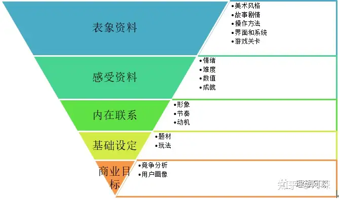

<<<<<<< HEAD
# 游戏分析

按照由浅入深的5个层次，对游戏进行分析。参考文章：

[游戏策划如何拆解游戏并分析游戏？](https://www.zhihu.com/question/571877225)

5层模型：

=======
# CodeForFun
此仓库存放了我写过的一些简单项目，这些项目或是个人生活中的一些实际需求，或是偶然产生的灵感。

## 六爻排盘
在六爻占卦的实践中，排盘是一种机械性的查表工作。为简化每次起卦的工作量，我写了个程序帮我自动排盘。代码在“LiuYao”文件夹中。

main.py是命令行的文字模式；

GUI.py是图形化界面模式。

## 日语学习
在学习日语的过程中，我写了一套程序辅助学习。它包含两个模块：语法管理模块和背单词模块。

**语法管理**
“SentenceManager”文件夹内存放了语法管理模块的代码。它可以结构化地存储每个例句包含的语法要点，方便随时查找复习。

**背单词**
“背单词”文件夹内存放了背单词模块的代码。每次运行时，它从用户存储的单词文件中抽取若干单词，分难度等级进行考察，最后更新正确率。目前尚未开发GUI版本，因为命令行版本已经满足我的需求 : )

之后会开发GUI版本的背单词功能并将这两个模块整合到一起。

## 杀戮尖塔角色mod
杀戮尖塔这个游戏的角色mod，以研究生为主题，代码在“STSMod”下。后续会完善相关动画和特效。
>>>>>>> ebea1e57859f79704d2d27ed0aa6130d792a8fa7
